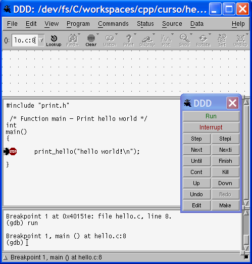
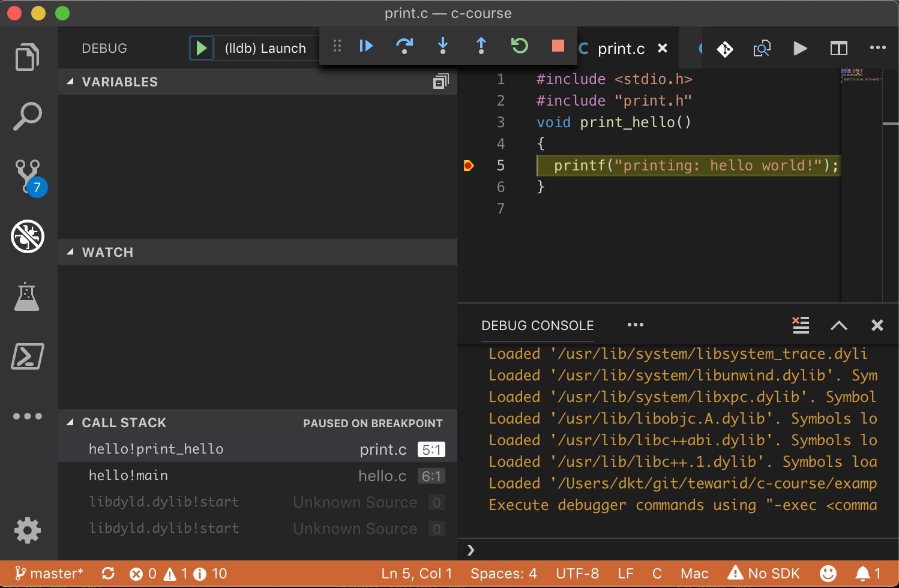

# Introduction

## History

- [Originally designed and implemented by Dennis Ritchie on a DEC PDP-11](http://cm.bell-labs.co/who/dmr/chist.html)

- Influenced by [B](http://cm.bell-labs.co/who/dmr/bintro.html) written by Ken Thompson in 1970

- First C standard in 1988 by ANSI (C89)

- Adopted by ISO in 1990 (C90)

- [Most recent standard](http://www.open-std.org/jtc1/sc22/wg14/) C99 by ISO

- Compiled language

- Source code portable

## C program – hello.c

```c
#include <stdio.h>

 /* function main - print hello world */
int
main()
{
    printf("hello world!\n");
    return 0;
}
```

## C program structure

- Multi-line comments begin with `/*` and end with `*/`, these are called delimiters

- `#` is used to begin pre-processor directives

- Execution of a C program begins at function main
  - main can return an int value to the operating system otherwise it should return void

- Code blocks and function bodies begin with { and end with }

- C statements end with a semicolon ;

## Executing hello.c

- Use [GCC](http://gcc.gnu.org/)

  ```bash
  gcc hello.c -o hello -Wall
  ```

- Without -o option the output is named a.out

- Execute

  ```bash
  ./hello
  ```

- Output

  ```text
  hello world!
  ```

## Compilation process

- Compiler produces the executable by performing the following steps

  - Pre-processing

  - Compilation and assembly

  - Linking

## Pre-processing

- Conceptual first step in compilation

- Two tasks commonly performed

- File inclusion with `#include` directive

  ```c
  #include <stdio.h>
  ```

- Macro substitution with `#define` directive

  ```c
  #define pf printf
  pf("hello world!")
  ```

## Compilation and assembly

- Lexical and semantic analysis to generate intermediate code

- Transform the intermediate code to assembly or machine code

- Creating an object file using GCC

  ```bash
  gcc hello.c -c
  ```

  - The -c option tells GCC not to perform linking

  - A file called `hello.o` is produced

## Linking

- Linking combines all the object files and required library code to produce a single executable

  ```bash
  gcc hello.o -o hello
  ```

## Multiple source files – hello.c

```c
#include "print.h"
/* Function main - Print hello world */
int
main()
{
  print_hello();
}
```

## Multiple source files – print.c

```c
#include <stdio.h>
#include "print.h"
void print_hello()
{
  printf("printing: hello world!\n");
}
```

## Multiple source files – print.h

```c
#ifndef _PRINT_H_
#define _PRINT_H_

extern void print_hello();

#endif //_PRINT_H_
```

- `#ifndef` / `#endif` prevents pre-processor from including same file twice

## Simple compilation

- Compile and link using gcc

  ```bash
  gcc hello.c print.c -o hello
  ```

- Execute

  ```bash
  ./hello
  ```

- Output

  ```text
  printing: hello world!
  ```

## Complex Compilation - With Error

- Compile `hello.c` using gcc; produces `hello.c`

  ```bash
  gcc hello.c -c
  ```

- Compile `print.c`; produces `print.o`

  ```bash
  gcc print.c -c
  ```

- Link using gcc

  ```bash
  gcc hello.o -o hello
  ```

  ```text
  hello.o(.text+0x27):hello.c: undefined reference to `_print_hello'
  collect2: ld returned 1 exit status
  ```

## Complex Compilation – Correcting the Error

- Link using gcc

  ```bash
  gcc hello.o print.o -o hello
  ```

- Using [ld](https://www.gnu.org/software/binutils/)

  ```bash
  ld -o hello \
  /lib/crt0.o -L/opt/gcc.3.3/lib/gcc-lib/i586-pc-interix3/3.3 \
  hello.o print.o -lgcc -lc -lpsxdll -v
  ```

  - Calling gcc with `-v` switch shows how
  - Note path to `libgcc.a` in my Windows SFU installation

## Using a Graphical Debugger

- DDD is a graphical debugger for X Windows and it uses gdb, the command line debugger

- Re-compile source code with extra debug information for gdb

  ```bash
  gcc -g hello.c print.c -o hello
  ```

- Execute ddd

  ```bash
  ddd hello
  ```

- Try stepping through code and adding watch expressions

- Repeat with VS Code

## Debug Using DDD



## Debug Using VS Code



## Other Topics

- Creating static and shared libraries

- Dynamic linking

- GCC compile, link and optimize options

- Building applications with make

- Using an IDE for C/C++ development
